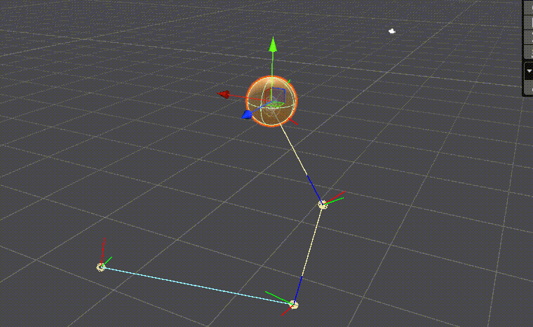
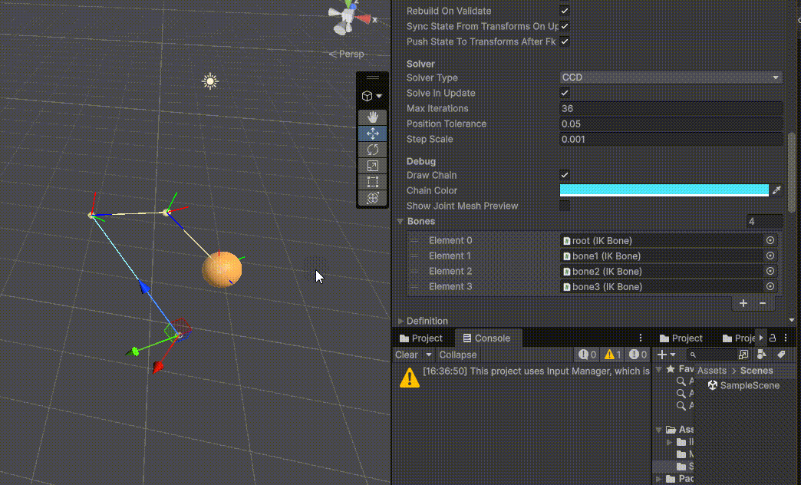

# IK Solver

BUAA Matrix Analysis II 2026 Spring 课程作业项目。  
本项目基于 Unity 实现一个面向骨骼链的逆运动学求解器框架，围绕多种经典 IK 方法展开，包括 CCD、Jacobian Transpose、Damped Least Squares 以及基于奇异值分析的自适应阻尼 DLS。项目目标不仅是完成可运行的 IK 系统，也希望通过统一的 benchmark 流程，对不同数值方法在收敛性、时间开销、误差控制与姿态稳定性上的差异进行量化比较。

当前工程采用较清晰的分层结构：`Authoring` 负责从 Unity 场景组织骨骼链与参数输入，`Model` 定义链、关节、请求与结果等纯数据结构，`Core` 实现前向运动学与雅可比矩阵相关公共计算，`Solvers` 放置不同 IK 求解器实现，`Tests` 提供基准测试与结果导出，`Demo` 用于场景展示与可视化验证。


**CCD Solver**



**Jacobian-based Solver**



## Quick Start

使用 Unity 打开工程目录：

`C:\Users\PC\Desktop\workingSpace\unityProject\IK\IK`

等待脚本编译完成后，可以从两个入口开始使用。

如果想直接体验 IK 功能，可打开 `Assets/IK/Demo/Scenes` 下的示例场景，在场景中的骨骼链对象上挂载 `IKChain` 组件，通过 Inspector 选择求解器类型，并设置目标点、迭代次数和步长等参数。运行后，系统会从当前骨骼姿态构建 `ChainState`，调用指定 solver 完成求解，再将结果写回场景骨骼。

如果想运行 benchmark，可打开 `Window > General > Test Runner`，在 `EditMode` 中执行 `GenerateStepSweepBenchmarkCsvForCurrentSolvers`。测试完成后，结果会写入：

[`C:/Users/PC/Desktop/workingSpace/unityProject/IK/IK/Assets/IK/Tests/Results`](C:/Users/PC/Desktop/workingSpace/unityProject/IK/IK/Assets/IK/Tests/Results)

之后可运行：

```powershell
python C:\Users\PC\Desktop\workingSpace\unityProject\IK\IK\Assets\IK\Tests\Results\plot_ik_benchmark.py
```

生成折线图与综合评分条形图。

## 功能指引

项目当前支持以下 IK 求解器：

- `CCDSolver`：以末端误差为导向逐关节回溯更新，结构简单，易于调试。
- `JacobianTransposeSolver`：基于梯度下降思想，用雅可比转置给出关节增量方向。
- `JacobianDampedLeastSquaresSolver`：通过在法方程中加入阻尼项缓解奇异与数值不稳定问题。
- `JacobianSvdDampedLeastSquaresSolver`：利用奇异值分析自适应调整阻尼系数，以提升在奇异附近的鲁棒性。

若希望理解核心计算流程，建议优先阅读：

- [`IKChain.cs`](C:/Users/PC/Desktop/workingSpace/unityProject/IK/IK/Assets/IK/Runtime/Authoring/IKChain.cs)
- [`ForwardKinematics.cs`](C:/Users/PC/Desktop/workingSpace/unityProject/IK/IK/Assets/IK/Runtime/Core/ForwardKinematics.cs)
- [`JacobianBuilder.cs`](C:/Users/PC/Desktop/workingSpace/unityProject/IK/IK/Assets/IK/Runtime/Core/JacobianBuilder.cs)
- [`JacobianMath.cs`](C:/Users/PC/Desktop/workingSpace/unityProject/IK/IK/Assets/IK/Runtime/Core/JacobianMath.cs)

若希望调整实验设置，主要入口在：

- [`IKBenchmarkModels.cs`](C:/Users/PC/Desktop/workingSpace/unityProject/IK/IK/Assets/IK/Tests/EditMode/Editor/IKBenchmarkModels.cs)：样本规模、迭代次数、容忍度、步长扫描范围
- [`IKSolverBenchmarks.cs`](C:/Users/PC/Desktop/workingSpace/unityProject/IK/IK/Assets/IK/Tests/EditMode/Editor/IKSolverBenchmarks.cs)：参与对比的 solver 与阻尼参数
- [`IKBenchmarkRunner.cs`](C:/Users/PC/Desktop/workingSpace/unityProject/IK/IK/Assets/IK/Tests/EditMode/Editor/IKBenchmarkRunner.cs)：指标统计与综合评分计算

benchmark 当前针对可达与不可达目标分别统计平均成功迭代次数、平均结束时间、平均最终误差和关节旋转偏离度，并基于这些指标构建综合评分，用于评估精度、效率与稳定性之间的折中。图像与 CSV 均输出到 `Assets/IK/Tests/Results`，便于进一步做论文图表整理与结果分析。
